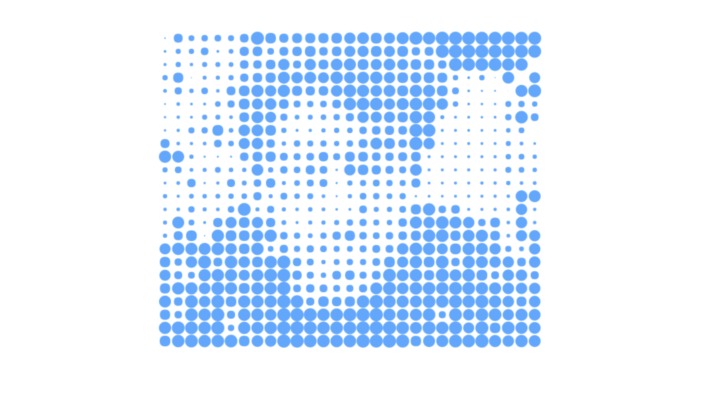

# Blobcam

> A tiny HTML5 canvas experiment to turn your webcam video feed into a grid of blobs (like dot matrix).

The JS file detects video, streams it to a hidden canvas element, then analyses this canvas to see the darkness of each pixel. It then draws a grid of blobs, with darker pixels being painted with big blobs, and lighter pixels with little blobs. This makes an image that kinda looks like you, and kinda doesn't.

(Forgive the messy JavaScript, it's only an experiment!)
